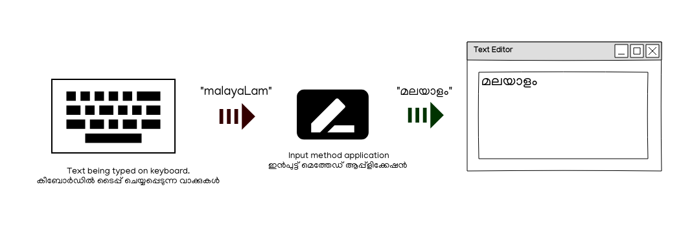

# Table of Contents

1.  [Enabling Malayalam on your computer - A comprehensive guide.](#orgbcf2810)
    1.  [Terminology](#orgea2f79f)
        1.  [Fonts](#orga871f94)
        2.  [Input methods](#orgb9b6cac)
        3.  [Localisation](#orgc29d820)
    2.  [How to : Using Malayalam on GNU/Linux](#org83aa0e3)
        1.  [Installing fonts](#orgc58f42c)
        2.  [User interface localisation](#orgc04dc80)
        3.  [Input methods](#org92d977b)
    3.  [How to : Using Malayalam on Illustrator/Photoshop](#orgec36ee8)
    4.  [How to : Using Malayalam on Windows](#org9059ba3)
        1.  [Installing fonts](#orgec21fb2)
        2.  [Input methods](#org1f56f69)
        3.  [User interface localisation](#org3473e2c)
    5.  [How to : Using Malayalam on MacOS](#orgdf42866)
        1.  [Installing fonts](#orgf22a0e2)
        2.  [Input methods](#org5a423c4)
        3.  [User interface localisation](#org5f8000a)
    6.  [How to : Using malayalam On Android](#orga0e21d6)
        1.  [Input](#org49e209f)
        2.  [User Interface](#orgad5cf31)
    7.  [iOS : Using malayalam](#org42d1910)

# Enabling Malayalam on your computer - A detailed guide.

## Terminology

Before we go into details, it would be good to explain some terminology. You can skip it entirely if you are not interested in details.

In general though getting a language to work in an operating system requires that we take care of the following aspects.

1.  Fonts (Displaying the language)
2.  Input (Getting the computers to accept keystrokes in the chosen language)
3.  Localisation (Displaying the operating systems interface in the language)

### Fonts

Fonts in a computer are files that contain graphic data about one or more sets of related characters (English, Malayalam etc). 

The graphical data in the file determines how the computers draws a letter (or combinations of letters) on the screen. 

A font file can contain many languages, or only one. 

If you ask the computer's operating system to use a particular font and its file does not contain a certain language, the computer will fall back to pre-set defaults.

### Input methods

"Input method" is the generic name for software that interprets the keystrokes you make and translate them into appropriate Unicode characters.

The following image roughly explains what an input method does.

 

Almost all operating systems have an input method application for typing characters other than English. 

Windows has a built-in input method, but there are Free and Open Source alternatives that provide better facilities such as Keyman.

Mac OS also has a built-in input method. Keyman is available for Mac OS too.

GNU/Linux systems have many to choose from. The most commonly used ones are "ibus" and "fcitx"

Android also has many input methods to choose from. We support SMC's Indic Keyboard.

1.  Keyboard layouts

    Keyboard layouts are software schemes that tell input methods how to interpret individual keystrokes or combinations.
    
    For example, if you want the result of typing "a" in a keyboard to be translated to "അ" then that "mapping" is stored in a keyboard layout.
    
    The Input method sits between a program and the keyboard, takes the keystrokes, then looks at the character and its target mapping on the keyboard layout. 
    It then gives the resulting characters to the program that receives the input, like a text editor.
    
    There are several keyboard layouts for Malayalam available with popular input methods on GNU/Linux machines.
    
    Swanalekha
    Inscript
    Lalitha
    Mozhi
    Remington (Typewriter)

### Localisation

Localisation is the process of translating the UI presented by the computer into the user's language. 

Even though people maybe comfortable with English, some would prefer their mother tongue. 

Note that all programs may not be localised. For example, even if your operating system is set to use Malayalam, Firefox maynot show Malayalam interface simply because it hasn't been translated yet.

Windows has a Malayalam UI (unverified).
GNU/Linux has KDE and GNOME Desktops.
Mac OS has no Malayalam user interface support (unverified).
Android has Malayalam user interface.

## How to : Using Malayalam on GNU/Linux

### Installing fonts

1.  OS Methods

    TODO : elaborate.
    
    Fonts are in the repositories for
    
    -   Fedora
    -   Ubuntu
    -   Debian
    -   Arch via AUR

2.  Generic Method

    -   Download and install by copying to .fonts
    -   Investigate if GNOME and KDE does this without any intervention through command line foolery.

### User interface localisation

### Input methods

1.  Ibus

    GNOME
    KDE

2.  Fcitx

    GNOME
    KDE

## How to : Using Malayalam on Illustrator/Photoshop

## How to : Using Malayalam on Windows

### Installing fonts

### Input methods

### User interface localisation

## How to : Using Malayalam on MacOS

### Installing fonts

### Input methods

### User interface localisation

## How to : Using malayalam On Android

### Input

### User Interface

## iOS : Using malayalam

1.  Input

2.  User Interface

